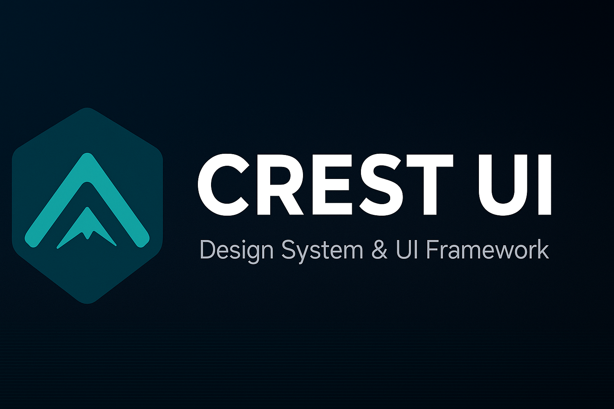

# 🏔️ Crest UI — Design System

A design-forward, component-driven UI system that blends modern SaaS clarity with the textures and palette of the high desert and mountains. Built for speed, polish, and multi-brand extensibility across Crest Code Creative projects.

- **Framework**: React + Next.js
- **Styling**: Tailwind CSS + Radix primitives inspiration
- **Library base**: ShadCN/UI patterns adapted to Crest tokens
- **Docs**: Storybook (Vite builder)
- **Monorepo**: Turbo + npm workspaces


## ✨ Highlights
- **Nature + Precision** aesthetics with calm, intentional UI
- **Design tokens** as a single source of truth (JSON → CSS variables → Tailwind)
- **Reusable primitives** with accessible defaults
- **Multi-brand theming** (TeamCrest, Yoga-Flow, High Desert Holistic)
- **AI-friendly** schemas for prompt-to-component generation (planned)


## 🚀 Quickstart
- **Requirements**: Node 18+ and npm
- **Install**
  ```bash
  npm install
  ```
- **Run the demo app** (Next.js)
  ```bash
  npm run dev
  # http://localhost:3000
  ```
- **Run the docs** (Storybook)
  ```bash
  npm run docs
  # http://localhost:6006
  ```


## 🧱 Monorepo structure
```
/crest-ui/
├── apps/
│   ├── demo/          # Next.js demo app
│   └── docs/          # Storybook docs (Vite builder)
└── packages/
    ├── ui/            # Core React components (Button, Input, ...)
    ├── tokens/        # Design tokens (tokens.json + CSS variables)
    ├── config/        # Tailwind preset + base tsconfig
    └── themes/        # Brand themes (overrides)
```


## 🎨 Design tokens
Tokens live in `packages/tokens/tokens.json` and are exposed as **CSS variables** for easy consumption across apps.

- **Colors**: `crest-blue-500`, `sand-200`, `mesa-400`, `peak-950`
- **Typography**: Display `League Spartan`, Sans `Inter`
- **Radius**: `--radius-md: 12px`
- **Elevation**: `--shadow-low|mid|high`

Usage (global CSS):
```css
@import "@crest-ui/tokens/css/variables.css";
```
Usage (Tailwind classes via preset):
```tsx
<button className="bg-crest-blue-500 text-white rounded-xl shadow-low">Crest</button>
```


## 🧩 Components
The UI package provides accessible, token-aware primitives.

- **Available now**: `Button`, `Input`, `Card`, `Tabs`, `Badge`, `Alert`, `Tooltip`, `Modal`, `Navbar`, `Breadcrumbs`, `Footer`, `TextArea`, `Select`, `Checkbox`, `Switch`, `Avatar`, `Drawer`
- **Planned**: 


## 🧩 Storybook docs
- Location: `apps/docs`
- Global styles: `apps/docs/src/styles.css` imports token CSS and Tailwind layers
- Tailwind scanning includes `packages/ui/src` so classes used in the component library are picked up
- Author pages in **MDX** when you want narrative + guidelines, or use **Autodocs** for fast prop tables from TS


## 🧪 Testing
- Runner: **Vitest** (jsdom) with **React Testing Library** and **user-event**
- Location: tests live next to components, e.g. `packages/ui/src/*.test.tsx`
- Scripts:
  ```bash
  # all packages
  npm run test
  
  # UI package only
  npm run test -w @crest-ui/ui
  npm run test:watch -w @crest-ui/ui
  npm run coverage -w @crest-ui/ui
  ```
- TypeScript tips:
- Node versions: Vitest 4 targets Node 20/22/24. If you see engine warnings on other versions, use an LTS version.


## 🪶 Visual identity
- **Iconography**: Geometric, Lucide-inspired
- **Palette**: Earthy tones (sand, mesa) with sky/sunrise accents
- **Motion**: Ease-out cubic transitions, subtle parallax/physics micro-interactions


## 🎛️ Theming (multi-brand)
Use CSS variable overrides or data attributes to switch brands at runtime.

Example (brand switch using a data attribute):
```tsx
<html data-brand="teamcrest">
  {/* ... */}
</html>
```
```css
/* Override tokens for TeamCrest */
html[data-brand="teamcrest"] {
  --color-crest-blue-500: 22 119 255; /* example override */
}
```
Organize brand objects in `packages/themes` and generate CSS (optional) or apply via decorators in Storybook to preview.


## ♿ Accessibility & quality
- **A11y**: Aim for WCAG 2.1 AA; Storybook A11y addon for checks
- **Tests** (planned): Vitest + React Testing Library
- **Lint/format**: ESLint + Prettier (base config present)
- **Performance**: Keep bundles lean; analyze and tree-shake where possible


## 🧠 AI integration (roadmap)
- `components.schema.json` to describe component props/variants
- Embeddings for natural-language retrieval of docs
- Prompt-to-component generation and layout composition helpers


## 🗺️ Roadmap (from PRD)
- **Phase 1**: Tokens + Base Components (Button, Inputs)
- **Phase 2**: Layout & Navigation (Cards, Modals, Nav, Footer)
- **Phase 3**: Product-specific components (Scheduler, Pose Player)
- **Phase 4**: Theming & Documentation (multi-brand, docs site)
- **Phase 5**: AI Integration (schemas + retrieval pipeline)


## 🤝 Contributing
- Start everything:
  ```bash
  npm run dev   # demo + package watches via turbo
  npm run docs  # storybook docs
  ```
- Develop components in `packages/ui/src` and create matching stories in `apps/docs/stories`.
- Keep token usage consistent. Prefer utility classes powered by the preset.
- Accessibility first: keyboard states, focus rings, labels, color contrast.


## 📎 References & inspiration
- [ShadCN/UI](https://ui.shadcn.com/)
- [Radix Primitives](https://www.radix-ui.com/)
- [Tailwind CSS](https://tailwindcss.com/)
- [Storybook](https://storybook.js.org/)
- [Framer Motion](https://www.framer.com/motion/)


## 🔒 License
License **TBD**. Choose MIT/Apache-2.0 or similar if you intend public reuse.


---

Made with intention in the Gunnison Valley — built to travel everywhere.
